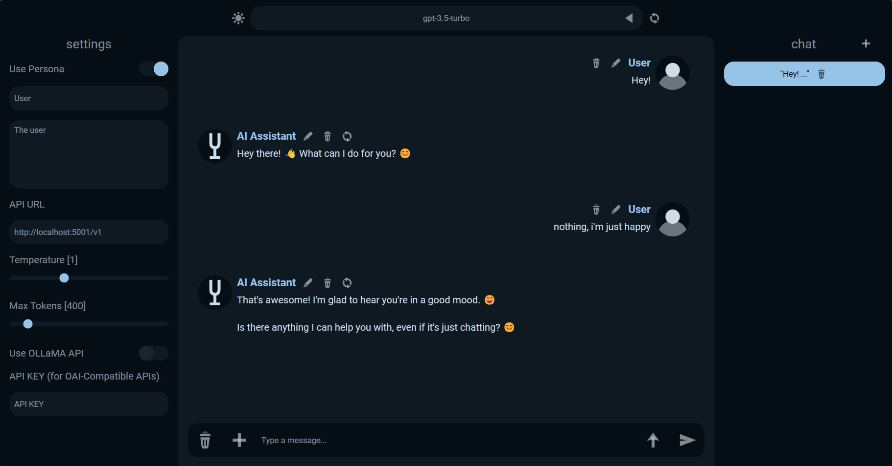
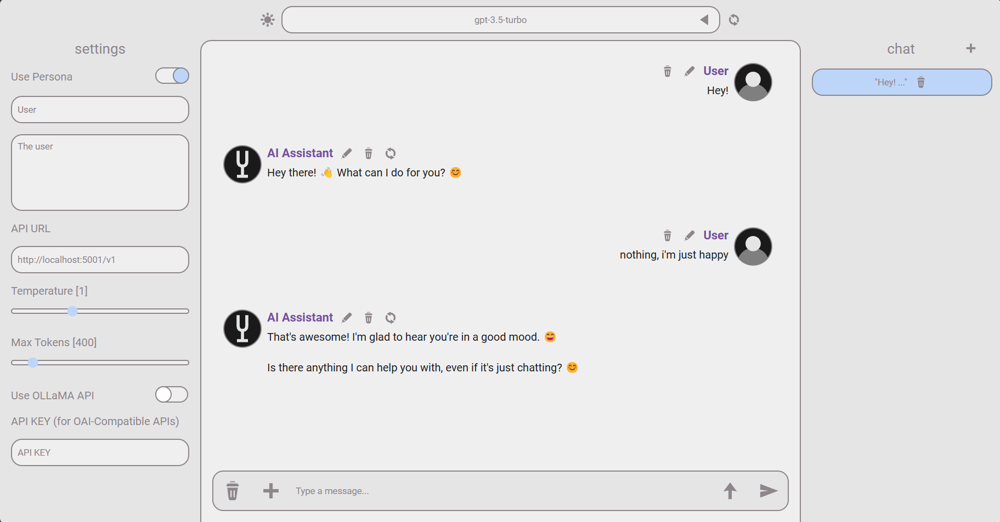

# A.I.U.I 🤘

This is AIUI🚀, a simple yet powerful web UI for ~~Ollama🦙~~ (New: added support for OAI-Compatible APIs! (OAI, Kobold...)).
Features:
- 💬Chat 
- 💵OAI Compatible
- 🧷Sending images
- 🤪Import Character Cards
- 🚀Prompts
- 🥸Cool UI
- 🤖Send message as AI
- 🗯️Formatting (asterisks, quotes, etc.)
- 🌡️Temperature
- 🧑Persona
- ✅Model selection
- ✏️Message edit/remove/regen
- 💻Multiple saved chats
- 🌍Saved in browser

Made in Svelte and Vite. I'll probably port it to electron soon.

### Requirements
You'll need:
- [OLLaMA/Kobold/OpenAI Key](https://ollama.com/) (remote or local)
- [NodeJS](https://nodejs.org/) (if running locally)

### Installing
`npm install`  
`npm run dev`  

Or, use the start.bat file included which will do that for you!  
Or, use the deployed [AIUI](https://aiui-delta.vercel.app/) which works with your local models without installing the website!

## Usage
1. For Ollama, activate "Use OLLaMA API". For OAI-Compatible APIs, deactivate it and put you API Key if needed.
2. Set your API URL, make sure your URL does **NOT** end with `/`. For OAI APIs, make sure you include the `/v1` if the API needs it.
3. I recommend using Chrome/Hermit when using Android because other browsers like Edge don't seem to scale properly when opening the keyboard.  Hermit is the only browser which scales perfectly.
