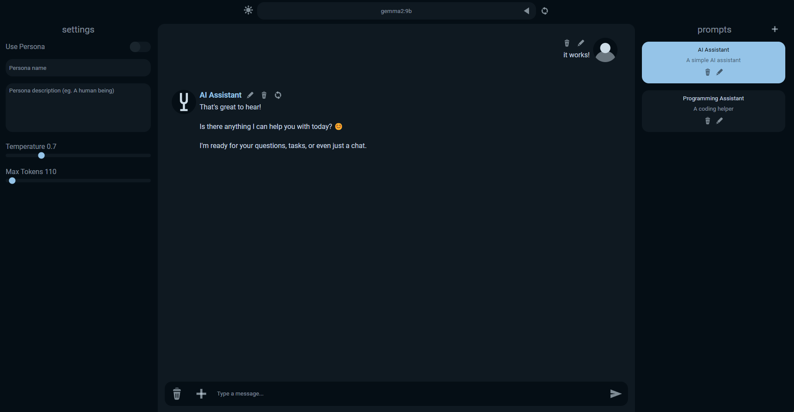

# A.I.U.I 🤘

This is AIUI🚀, a simple yet powerful web UI for Ollama🦙.
Features:
- 💬Chat 
- 🧷Sending images
- 🤪Import Character Cards
- 🚀Prompts
- 🥸Cool UI
- 🤖Send message as AI
- 🗯️Formatting (asterisks, quotes, etc.)
- 🌡️Temperature
- 🧑Persona
- ✅Model selection
- ✏️Message edit/remove/regen
- 💻Multiple saved chats
- 🌍Saved in browser

Made in Svelte and Vite. I'll probably port it to electron soon.

### Requirements
You'll need: `ollama`, `NodeJS`, `NPM`

### Usage
`npm install`  
`npm run dev`  

Or, use the start.bat file included which will do that for you!